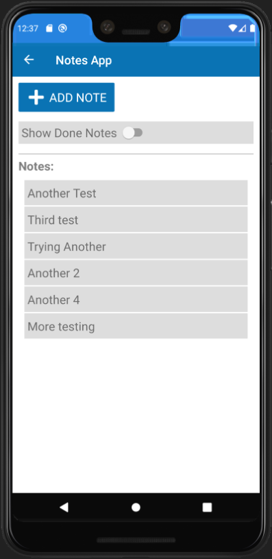
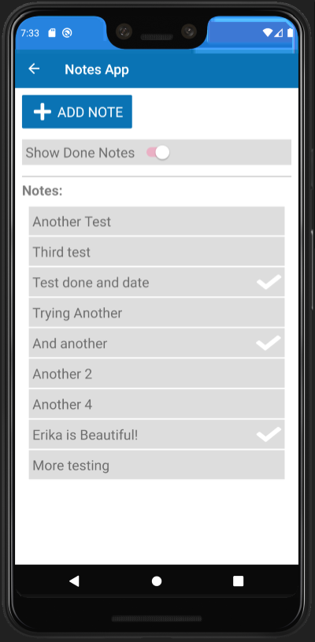
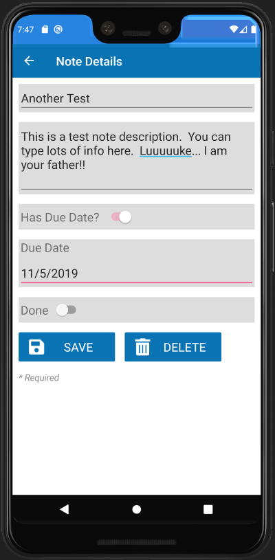
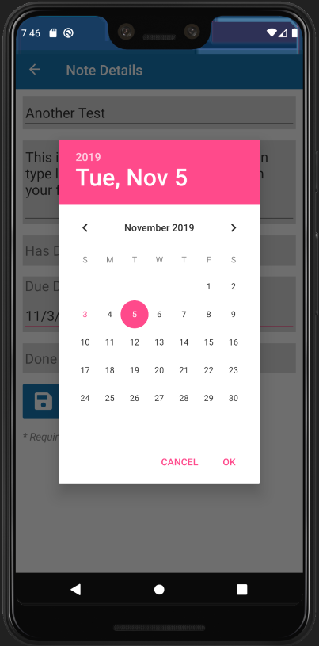

# xamarin-notes-mvvm

## Intro / Approach
I'm teaching myself Xamarin and I wanted a playground to mess around with various concepts... hence this repo.

I removed the XAML files and built all UI screens using Xamarin Forms in the common project using only C# code.  I did not touch the iOS, Android, or UWP projects at all.  I used SQLite for persistent local device storage.

## The App
This is not intended to be a _practical_ application.  In other words, it is _not_ designed around a good user experience or earth-shattering functionality.  This was literally a playground for me to learn Xamarin.  Nothing more.  The app allows users to enter notes.  Notes primarily have a Title and Description.  Optionally, a toggle can allow for assigning due dates.  If enabled, due dates are selected using a calendar control.  Finally, notes can be marked as "done".  On the main screen, only "not done" notes are shown.  However, the user can toggle to see all non-deleted notes.

Notes can be created, updated, and deleted.  All deletes are soft-deletes so that information can be synced back to a central warehouse.

## Sync Engine
This is not yet created.  Soon, I will create a Sync Engine infrastructure that will allow devices to work seamlessly when disconnected.  The devices will periodically sync back to an Azure database via Azure API's & functions, storing their data into a central Azure SQL Database.

## Screen Shots

**Splash Screen:**\
Serves no purpose other than to play with layouts, images, menus, navigation, etc.

**Main Notes App Screen:**\
Displays all non-deleted, non-done notes by default.  Can toggle to see non-deleted, done notes.  Has button to add a new note.

  

**Notes App Detail Screen:**\
Displays all controls needed to create, update, and/or delete notes.  The Due Date Calendar Control is visible or hidden based on the value of the `Has Due Date?` control.  The `Delete` button is disabled when adding a new note.  Also, the `Save` button is disabled if there is no `Note Title` value. 

  
