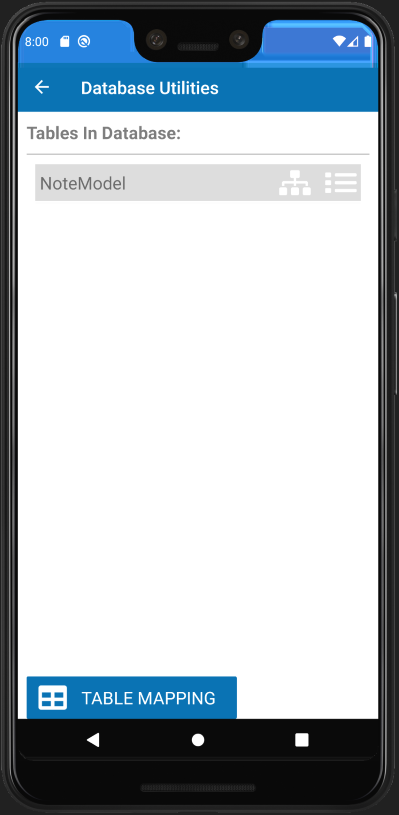
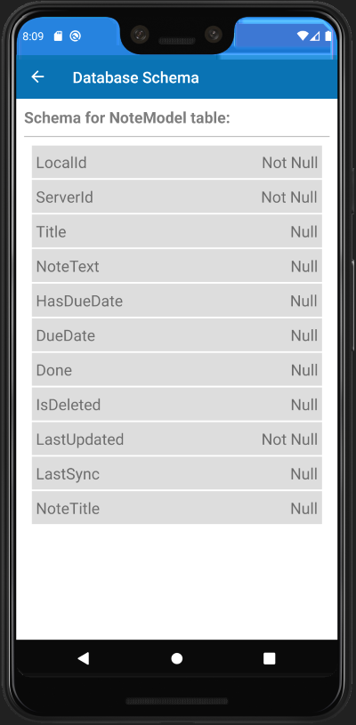
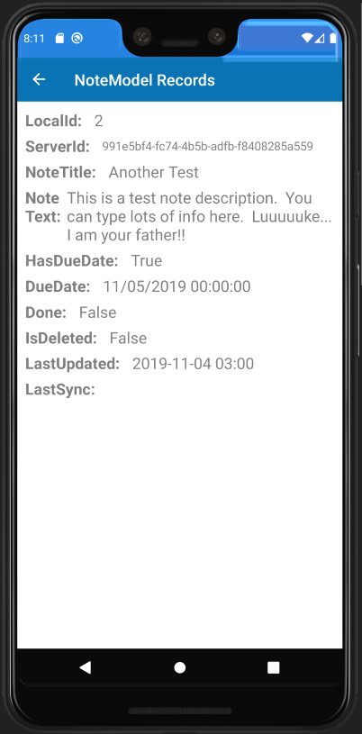

# xamarin-notes-mvvm

## Intro / Approach
I'm teaching myself `Xamarin` and I wanted a playground to mess around with various concepts... hence this repo.

I removed the `XAML` files and built all UI screens using `Xamarin Forms` in the common project using only C# code.  I did not touch the `iOS`, `Android`, or `UWP` projects at all.  I used `SQLite` for persistent local device storage.

## The App
This is not intended to be a _practical_ application.  In other words, it is _**not**_ designed around a sexy user experience or Earth-shatteringly original functionality.  This is just a playground for me to learn `Xamarin`...  Nothing more.  The app allows users to enter notes.  Notes primarily have a `Title` and `Description`.  Optionally, a toggle can allow for assigning due dates.  If enabled, due dates are selected using a calendar control.  Finally, notes can be marked as `Done`.  On the main screen, only "not done" notes are shown.  However, the user can toggle to see all non-deleted notes.

Notes can be created, updated, and deleted.  All deletes are soft-deletes so that information can be synced back to a central warehouse.

## Sync Engine
This is not yet created.  Soon, I will create a Sync Engine infrastructure that will allow devices to work seamlessly when disconnected.  The devices will periodically sync back to an Azure database via Azure API's & functions, storing their data into a central Azure SQL Database.

## Screen Shots

**Splash Screen:**\
Serves no purpose other than to play with layouts, images, menus, navigation, etc.

**Main Notes App Screen:**\
Tapping the `Notes App` menu item displays all non-deleted, non-done notes by default.  Can toggle to see non-deleted, done notes.  Has button to add a new note.

  

**Notes App Detail Screen:**\
Displays all controls needed to create, update, and/or delete notes.  The `Due Date Calendar Control` is visible or hidden based on the value of the `Has Due Date?` control.  The `Delete` button is disabled when adding a new note.  Also, the `Save` button is disabled if there is no `Note Title` value. 

  

**Database Main Screen:**\
The main screen behind the `Database` menu item shows a dynamic `ListView` control of all tables in the `SQLite` database _(currently only one table)_.  Each table displayed has two tappable icons. Tapping the first icon loads the `Database Schema` page and tapping the second icon loads a `CarouselPage` view that shows every record in the selected database table. _(For the time being, the `Table Mapping` button does nothing - I'm still messing with that!)_

**Database Schema Screen:**\
This screen shows all fields in the selected table, as well as an indicator showing if the fields are nullable or not-nullable. 

**Database Records Carousel Screens:**\
These views are accessable by swiping left and right.  There is one screen/view for each record in the selected table.  The formatting is only rudimentary at this point, but the main idea here was to experiment with the `CarouselPage` views, rather than spending a bunch of time making everything beautiful. 

